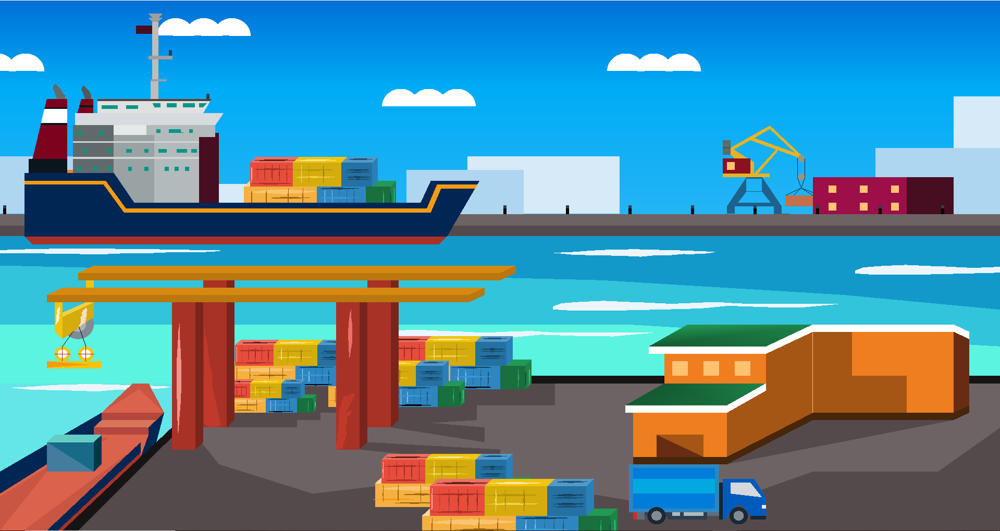
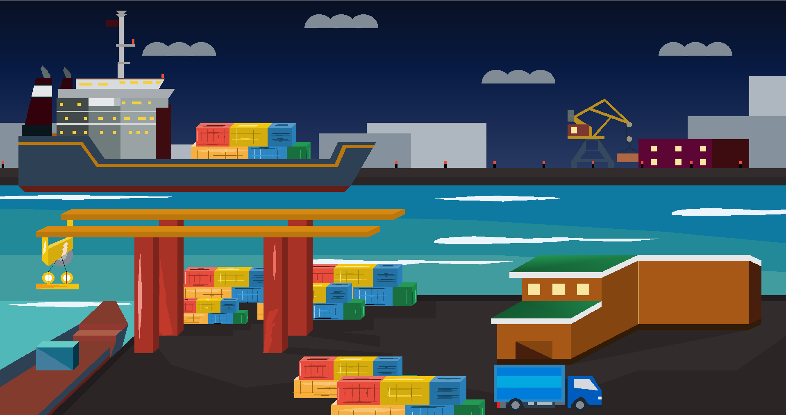

# Ship Simulation: A Journey from Port to Canal

This project aims to create an interactive computer graphics simulation representing a ship's journey through different scenarios, from departing a port, navigating an urban area, to crossing a canal.

## Objective

The main objective is to develop a visually immersive simulation showcasing the journey of a ship, incorporating user-controlled elements, dynamic weather transitions, and realistic challenges specific to each scenario.

## Overview

### Scenario 1: The Port

- Departure from a port where the ship is loaded with containers.
- User-controlled crane mechanism for moving and picking containers from the dock.

### Scenario 2: The Urban Area

- Navigation of the ship through a river passing an urban area.
- Realistic representation of buildings, bridges, and trains for an immersive environment.

### Scenario 3:
- Ship going through sea beach

### Scenario 4: The Canal

- Ship's traversal through a canal that facilitates crossing a mountain.
- Water rising and falling mechanisms enabling ship movement uphill and downhill.
- User control over water levels and canal gates.

## Features

1. **Dynamic Weather:**
   - Day and night environment transitions in every scenario.

2. **Object Movement:**
   - User-controlled ship, cars, trains, and planes.
   - Crane for loading and unloading containers.

3. **Bridge Feature:**
   - Inclusion of a bridge in the urban area scenario.

4. **Waterway Management:**
   - Demonstration of ship movement through mountains.
   - Multiple canal locks controlled by the user.

## Contributors

- [Ishtiak Billah Emon](https://github.com/ishtiak-billah-emon) 
- [Rafsan Mahmud](https://github.com/Raafsaan) 
- [Akid Mahmud](https://github.com/MahmudYagami) 

